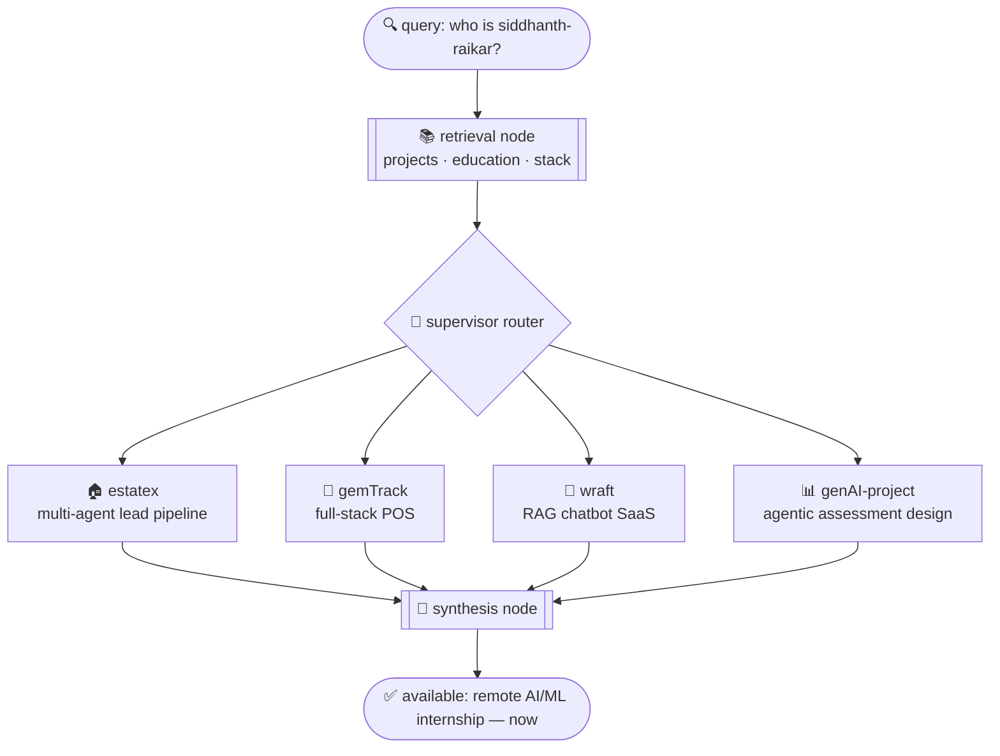

<table>
<tr>
<td width="130">

</td>
<td>

**Siddhanth Raikar** — building the agents that route, retrieve, and decide.
AI/Data Science undergrad · open to remote AI/ML internships · available now.

</td>
</tr>
</table>

---

### query resolution — `who is siddhanth-raikar?`

### resolved

- 🏠 **[estatex](https://github.com/frenemy17/estatex)** — LangGraph state machine, human-in-the-loop interrupts, 138+ tests → [demo](https://estatex-dun.vercel.app/)
- 💎 **[gemTrack](https://github.com/frenemy17/gemTrack)** — live gold-price billing, 10k+ SKU search optimization → [demo](https://gem-track-five.vercel.app/)
- 💬 **wraft** — multi-tenant RAG: ingestion → chunking → embedding → vector store → [demo](https://wraft-website-phi.vercel.app/)
- 📊 **[genAI-project](https://github.com/frenemy17/genAI-project)** — 5-node agent harness, Bloom's classifier (91.19% acc.) → [demo](https://genai-project-3tze9npwg4iz22mhjssdq3.streamlit.app/)

---

### 🐍 contribution graph, live

<picture>
  <source media="(prefers-color-scheme: dark)" srcset="https://raw.githubusercontent.com/frenemy17/frenemy17/output/github-contribution-grid-snake-dark.svg" />
  <source media="(prefers-color-scheme: light)" srcset="https://raw.githubusercontent.com/frenemy17/frenemy17/output/github-contribution-grid-snake.svg" />
  
</picture>

---

`linkedin.com/in/siddhanth-raikar-916a792aa` · `siddhanth.raikar2024@nst.rishihood.edu.in`

<!--AGENT_LOG_START-->
*last synced: 2026-09-17 · 214 days on GitHub · 29 repos · 4 followers*
<!--AGENT_LOG_END-->
