```mermaid
%%{init: {'theme': 'dark', 'themeVariables': { 'primaryColor': '#C5A55A', 'primaryTextColor': '#e0d5c1', 'primaryBorderColor': '#4A235A', 'lineColor': '#4A235A', 'secondaryColor': '#1a1a2e', 'tertiaryColor': '#0d1117'}}}%%
flowchart LR
    A["Input"] --> B["Router"]
    B --> C["Agent Pool"]
    C --> D{"Context?"}
    D -->|Yes| E["RAG"]
    D -->|No| F["Direct"]
    E --> G["Tools"]
    F --> G
    G --> H{"Confidence"}
    H -->|Low| I["Human Review"]
    H -->|High| J["Output"]
    I --> J

    style A fill:#0d1117,stroke:#C5A55A
    style B fill:#0d1117,stroke:#C5A55A
    style C fill:#0d1117,stroke:#C5A55A
    style D fill:#0d1117,stroke:#4A235A
    style E fill:#0d1117,stroke:#C5A55A
    style F fill:#0d1117,stroke:#C5A55A
    style G fill:#0d1117,stroke:#C5A55A
    style H fill:#0d1117,stroke:#4A235A
    style I fill:#0d1117,stroke:#8B0000
    style J fill:#0d1117,stroke:#C5A55A
```

<div align="center">


<a href="https://github.com/frenemy17">
  
</a>

# SIDDHANTH RAIKAR


<br/>

<a href="https://www.linkedin.com/in/siddhanth-raikar-916a792aa"></a>
<a href="https://github.com/frenemy17"></a>
<a href="mailto:siddhanth.raikar2024@nst.rishihood.edu.in"></a>


</div>

---


𝙰𝙸 / 𝙳𝚊𝚝𝚊 𝚂𝚌𝚒𝚎𝚗𝚌𝚎 𝚞𝚗𝚍𝚎𝚛𝚐𝚛𝚊𝚍. 𝙸 𝚋𝚞𝚒𝚕𝚍 𝚖𝚞𝚕𝚝𝚒-𝚊𝚐𝚎𝚗𝚝 𝚜𝚢𝚜𝚝𝚎𝚖𝚜, 𝚁𝙰𝙶 𝚙𝚒𝚙𝚎𝚕𝚒𝚗𝚎𝚜, 𝚊𝚗𝚍 𝙻𝙻𝙼 𝚋𝚊𝚌𝚔𝚎𝚗𝚍𝚜 — 𝚝𝚑𝚎 𝚘𝚛𝚌𝚑𝚎𝚜𝚝𝚛𝚊𝚝𝚒𝚘𝚗 𝚕𝚊𝚢𝚎𝚛, 𝚗𝚘𝚝 𝚓𝚞𝚜𝚝 𝚝𝚑𝚎 𝙰𝙿𝙸 𝚌𝚊𝚕𝚕.

```yaml
Currently working with: LangGraph, FastAPI, ChromaDB
Looking for: Remote AI/ML Internships
```

<br/><br/><br/>

---

<div align="center">

[](https://skillicons.dev)

<br/>


</div>

---

<table align="center">
<tr>
<td width="50%" valign="top">

### [estatex](https://github.com/frenemy17/estatex)
Multi-agent lead qualification · LangGraph state machine · 138 tests · human-in-the-loop

[](https://github.com/frenemy17/estatex)
[](https://estatex-dun.vercel.app/)

</td>
<td width="50%" valign="top">

### [gemTrack](https://github.com/frenemy17/gemTrack)
Full-stack jewelry POS · live gold pricing · 10k+ SKU search · Next.js + Express + MongoDB

[](https://github.com/frenemy17/gemTrack)
[](https://gem-track-five.vercel.app/)

</td>
</tr>
<tr>
<td width="50%" valign="top">

### [wraft](https://wraft-website-phi.vercel.app/)
Multi-tenant RAG chatbot SaaS · ingest → embed → store → retrieve

[](https://wraft-website-phi.vercel.app/)

</td>
<td width="50%" valign="top">

### [genAI-project](https://github.com/frenemy17/genAI-project)
5-node agent graph · Bloom's Taxonomy classifier (91.19% acc.) · exam gap-analysis

[](https://github.com/frenemy17/genAI-project)
[](https://genai-project-3tze9npwg4iz22mhjssdq3.streamlit.app/)

</td>
</tr>
</table>

---

<div align="center">



</div>

---

<div align="center">


<br/>


<br/><br/>


<br/>


</div>

---

<!--START_SECTION:activity-->
<!--END_SECTION:activity-->

<!-- 
    ↑ Auto-updating activity feed. Set up with:
    https://github.com/jamesgeorge007/github-activity-readme
    
    Add this GitHub Action to your frenemy17/frenemy17 repo:
    
    name: Update README
    on:
      schedule:
        - cron: '*/30 * * * *'
      workflow_dispatch:
    jobs:
      build:
        runs-on: ubuntu-latest
        name: Update this repo's README with recent activity
        steps:
          - uses: actions/checkout@v4
          - uses: jamesgeorge007/github-activity-readme@master
            env:
              GITHUB_TOKEN: ${{ secrets.GITHUB_TOKEN }}
-->

---


---

<picture>
  <source media="(prefers-color-scheme: dark)" srcset="https://raw.githubusercontent.com/frenemy17/frenemy17/output/github-contribution-grid-snake-dark.svg" />
  <source media="(prefers-color-scheme: light)" srcset="https://raw.githubusercontent.com/frenemy17/frenemy17/output/github-contribution-grid-snake.svg" />
  
</picture>

---

<div align="center">


<br/><br/>

<a href="https://www.linkedin.com/in/siddhanth-raikar-916a792aa"></a>
&nbsp;
<a href="https://github.com/frenemy17"></a>
&nbsp;
<a href="mailto:siddhanth.raikar2024@nst.rishihood.edu.in"></a>

<br/><br/>


</div>


