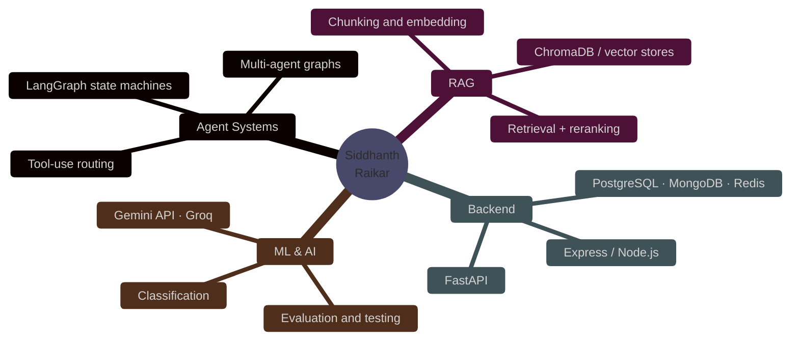

```mermaid
%%{init: {'theme': 'dark', 'themeVariables': { 'primaryColor': '#C0C0C0', 'primaryTextColor': '#09090b', 'primaryBorderColor': '#4a86e8', 'lineColor': '#4a86e8', 'secondaryColor': '#1f1f2e', 'tertiaryColor': '#09090b'}}}%%
flowchart LR
    A["Input<br/>User Query"] --> B["Router<br/>Intent Classification"]
    B --> C["Agent Pool<br/>Specialized Agents"]
    C --> D{"Needs<br/>Context?"}
    D -->|Yes| E["RAG Pipeline<br/>Retrieve → Rank → Augment"]
    D -->|No| F["Direct<br/>Response"]
    E --> G["Tool Use<br/>APIs · DB · Functions"]
    F --> G
    G --> H{"Confidence<br/>Check"}
    H -->|Low| I["Human-in-Loop<br/>Escalate & Confirm"]
    H -->|High| J["Output<br/>Validated Response"]
    I --> J

    style A fill:#09090b,stroke:#C0C0C0
    style B fill:#09090b,stroke:#C0C0C0
    style C fill:#09090b,stroke:#C0C0C0
    style D fill:#09090b,stroke:#4a86e8
    style E fill:#09090b,stroke:#C0C0C0
    style F fill:#09090b,stroke:#C0C0C0
    style G fill:#09090b,stroke:#C0C0C0
    style H fill:#09090b,stroke:#4a86e8
    style I fill:#09090b,stroke:#8B0000
    style J fill:#09090b,stroke:#C0C0C0
```

<div align="center">


<br/>

# SIDDHANTH RAIKAR


<br/>

<a href="https://www.linkedin.com/in/siddhanth-raikar-916a792aa"></a>
<a href="https://github.com/frenemy17"></a>
<a href="mailto:siddhanth.raikar2024@nst.rishihood.edu.in"></a>


</div>

<br/>

<table align="center">
<tr>
<td>

AI / Data Science undergrad. I build multi-agent systems, RAG pipelines, and LLM backends — the orchestration layer, not just the API call.

Most of my work is in **LangGraph**, **FastAPI**, and **ChromaDB**.

**Contact:** siddhanth.raikar2024@nst.rishihood.edu.in

</td>
</tr>
</table>

<br/>



<br/>

<div align="center">

<table>
<tr>
<td align="center" width="150"><b>Languages</b></td>
<td align="center" width="150"><b>Frontend</b></td>
<td align="center" width="150"><b>Backend</b></td>
<td align="center" width="150"><b>Data & DB</b></td>
<td align="center" width="150"><b>AI / LLM</b></td>
<td align="center" width="150"><b>Tools</b></td>
</tr>
<tr>
<td align="center">
  <br/><sub>Python</sub><br/>
  <br/><sub>C++</sub><br/>
  <br/><sub>JavaScript</sub>
</td>
<td align="center">
  <br/><sub>React</sub><br/>
  <br/><sub>Next.js</sub><br/>
  <br/><sub>HTML · CSS</sub>
</td>
<td align="center">
  <br/><sub>FastAPI</sub><br/>
  <br/><sub>Node.js</sub><br/>
  <br/><sub>Express</sub>
</td>
<td align="center">
  <br/><sub>PostgreSQL</sub><br/>
  <br/><sub>MongoDB</sub><br/>
  <br/><sub>Redis</sub>
</td>
<td align="center">
  <br/>
  <br/>
  <br/>
  
</td>
<td align="center">
  <br/><sub>Git</sub><br/>
  <br/><sub>GitHub</sub><br/>
  <br/><sub>Figma</sub>
</td>
</tr>
</table>

</div>

<br/>

<table align="center">
<tr>
<td width="50%" valign="top">

### [estatex](https://github.com/frenemy17/estatex)

<sup><b>MULTI-AGENT LEAD MANAGEMENT</b></sup>

```
Architecture : LangGraph State Machine
Agents       : Multi-agent orchestration
Testing      : 138+ automated tests
UX           : Human-in-the-loop interrupts
```

> Multi-agent lead qualification system with LangGraph. Agents route, qualify, and escalate through a state machine. 138 tests.

[](https://github.com/frenemy17/estatex)
[](https://estatex-dun.vercel.app/)

</td>
<td width="50%" valign="top">

### [gemTrack](https://github.com/frenemy17/gemTrack)

<sup><b>FULL-STACK JEWELRY POS</b></sup>

```
Stack        : Next.js · Express · MongoDB
Features     : Live gold pricing feed
Scale        : 10,000+ SKU search
Type         : Production POS system
```

> Full-stack POS for jewelry retail. Live gold pricing, 10k+ SKU search, inventory management.

[](https://github.com/frenemy17/gemTrack)
[](https://gem-track-five.vercel.app/)

</td>
</tr>
<tr>
<td width="50%" valign="top">

### [wraft](https://wraft-website-phi.vercel.app/)

<sup><b>MULTI-TENANT RAG SAAS</b></sup>

```
Pipeline     : Ingest → Embed → Store → Query
Architecture : Multi-tenant isolation
AI           : RAG with vector retrieval
Type         : SaaS chatbot
```

> Multi-tenant RAG chatbot. Each workspace gets its own knowledge base — ingest, chunk, embed, retrieve.

[](https://wraft-website-phi.vercel.app/)

</td>
<td width="50%" valign="top">

### [genAI-project](https://github.com/frenemy17/genAI-project)

<sup><b>5-NODE AGENT HARNESS</b></sup>

```
Agents       : 5-node orchestration graph
Classifier   : Bloom's Taxonomy (91.19%)
Pipeline     : Gap analysis → generation
Domain       : Educational AI
```

> 5-node agent graph for exam gap-analysis. Bloom's Taxonomy classifier at 91.19% accuracy, generates targeted study material.

[](https://github.com/frenemy17/genAI-project)
[](https://genai-project-3tze9npwg4iz22mhjssdq3.streamlit.app/)

</td>
</tr>
</table>

<br/>



<br/>

<div align="center">


<br/>


<br/><br/>


<br/>


</div>

<br/>


<br/>

<picture>
  <source media="(prefers-color-scheme: dark)" srcset="https://raw.githubusercontent.com/frenemy17/frenemy17/output/github-contribution-grid-snake-dark.svg" />
  <source media="(prefers-color-scheme: light)" srcset="https://raw.githubusercontent.com/frenemy17/frenemy17/output/github-contribution-grid-snake.svg" />
  
</picture>

<br/>

<div align="center">

---

<br/>

<a href="https://www.linkedin.com/in/siddhanth-raikar-916a792aa" target="_blank">
  
</a>
&nbsp;
<a href="https://github.com/frenemy17" target="_blank">
  
</a>
&nbsp;
<a href="mailto:siddhanth.raikar2024@nst.rishihood.edu.in" target="_blank">
  
</a>

<br/><br/>


</div>


